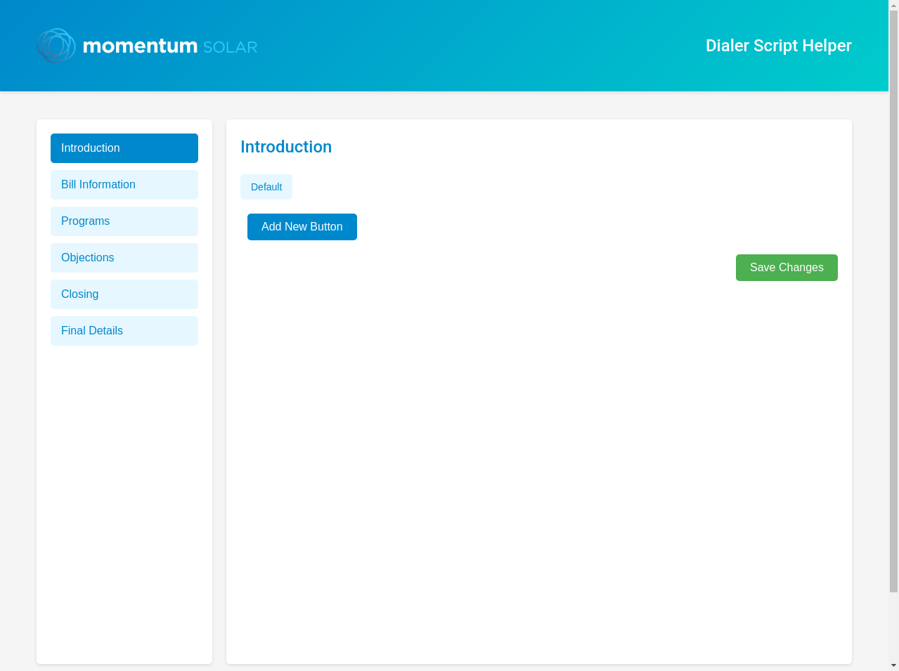

# Momentum Solar Dialer Script Helper

A web application for Momentum Solar sales representatives to manage and access their dialer scripts. This tool allows for easy editing and organization of sales scripts, objections, and closing statements.

## Features

- **Multi-section Script Management**: Organize scripts into Introduction, Bill Information, Programs, Objections, Closing, and Final Details
- **Button-based Organization**: Create multiple script variations within each section
- **Editable Content**: All script content can be edited and saved
- **Responsive Design**: Works on both desktop and mobile devices
- **Momentum Solar Branding**: Styled with Momentum Solar's color scheme and logo

## Screenshots



## Installation

### Prerequisites

- Python 3.8 or higher
- Git

### Setup Instructions

1. Clone the repository:
   ```
   git clone https://github.com/yourusername/momentum-solar-dialer-script.git
   cd momentum-solar-dialer-script
   ```

2. Create and activate a virtual environment:
   ```
   python -m venv venv
   
   # On Windows
   venv\Scripts\activate
   
   # On macOS/Linux
   source venv/bin/activate
   ```

3. Install dependencies:
   ```
   pip install -r requirements.txt
   ```

4. Run the application:
   ```
   python main.py
   ```

5. Access the application in your browser at:
   ```
   http://127.0.0.1:5000
   ```

## Deployment to GitHub Pages

Since this is a Flask application with a backend, it cannot be directly hosted on GitHub Pages (which only supports static websites). However, you can deploy it using one of these methods:

### Option 1: Deploy to Heroku

1. Create a Heroku account if you don't have one
2. Install the Heroku CLI
3. Create a `Procfile` in the root directory with the content:
   ```
   web: gunicorn main:app
   ```
4. Add `gunicorn` to requirements.txt
5. Deploy to Heroku:
   ```
   heroku login
   heroku create momentum-solar-dialer
   git push heroku main
   ```

### Option 2: Deploy to PythonAnywhere

1. Create a PythonAnywhere account
2. Upload your files to PythonAnywhere
3. Set up a web app with Flask
4. Configure the WSGI file to point to your app

### Option 3: Deploy to GitHub with GitHub Actions and a Custom Server

1. Push your code to GitHub
2. Set up GitHub Actions to deploy to your own server
3. Configure your server to run the Flask application

## GitHub Repository Setup

1. Create a new repository on GitHub
2. Initialize your local repository and push to GitHub:
   ```
   git init
   git add .
   git commit -m "Initial commit"
   git branch -M main
   git remote add origin https://github.com/yourusername/momentum-solar-dialer-script.git
   git push -u origin main
   ```

## Usage

1. Navigate to the different script sections using the sidebar
2. Click on any button to view and edit its content
3. Use the "Add New Button" feature to create new script variations
4. All changes are automatically saved when you click "Save Changes"

## Customization

- Update the logo: Replace the `logo.png` file in the `static` directory
- Modify colors: Edit the CSS variables in the `index.html` file
- Add new sections: Update the `script_content.json` file and modify the JavaScript code

## License

This project is proprietary and confidential. Unauthorized copying, distribution, or use is strictly prohibited.

## Created By

Developed exclusively for Momentum Solar by [Your Name/Company]
